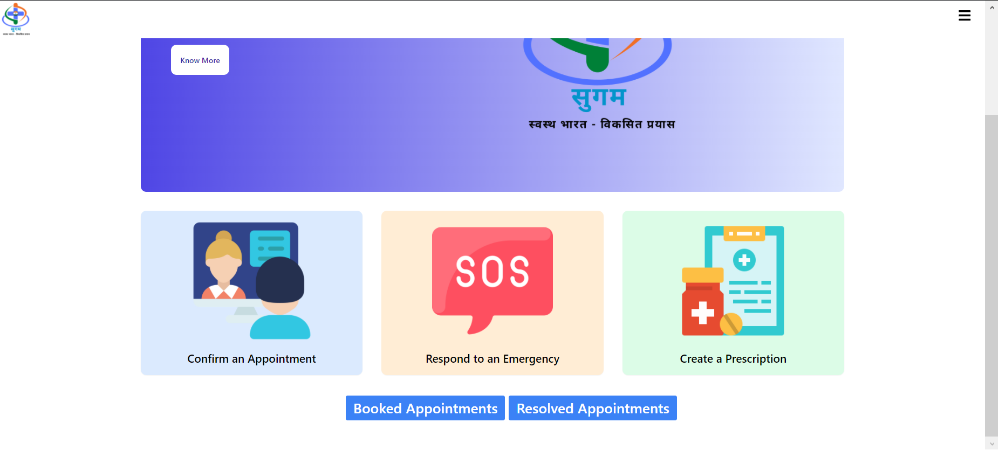
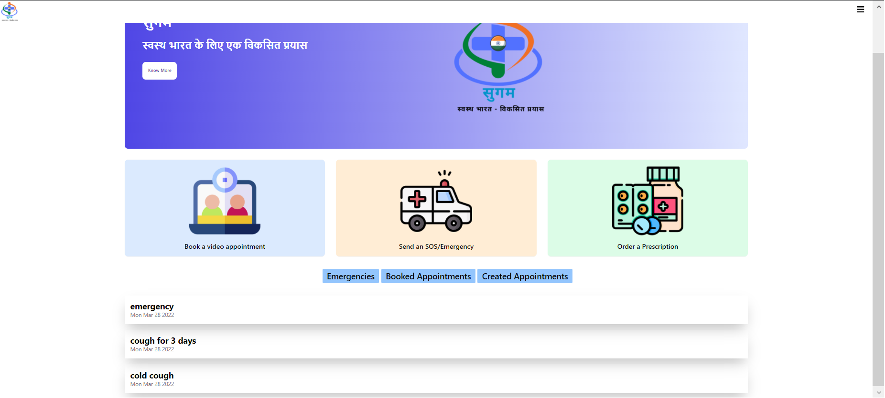
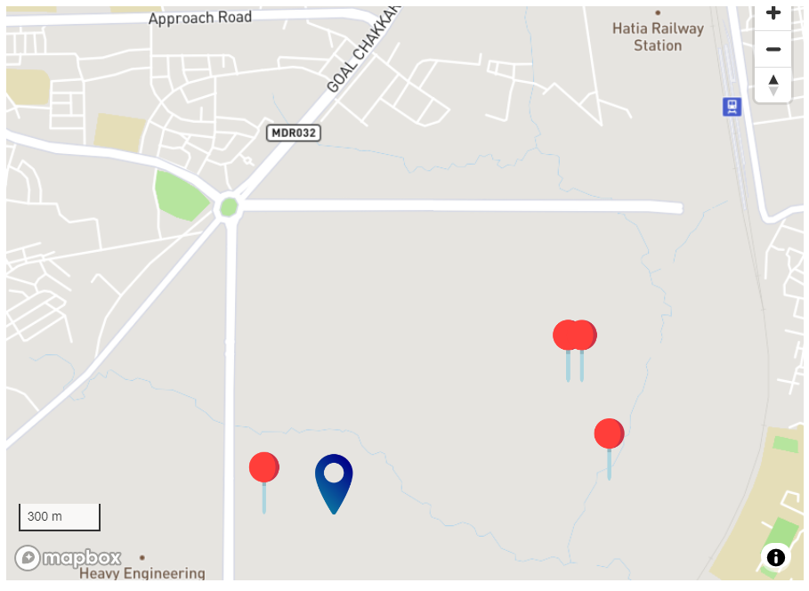

# Sugam

# Prototype UI Snippets
   
## Doctor Dashboard
   
 
   

## Patient Dashboard
   
 
   

## Drone Delivery and GPS based location Tracing by Medical Service Provider
   

## Core functional features:

-   Video/voice consultation with healthcare experts and certified professionals using peerjs or similar library. Video quality should be adjustable to enable easier connection in hilly and remote areas with slower internet speeds and lack of broadband connectivity.
    
-   Socket.io based chat for patient to doctor conversation in realtime. Chat should be safe and secure from a patient privacy point of view. Should also be saved over the db for later access.
    
-   Option to schedule appointments or request for doctor appointment in a given time window for less severe cases. May have to include slot based system for appointment scheduling.
    
-   Option to urgently ask for SOS or emergency medical care and priority basis dispersal of required emergency services by nearest healthcare provider or doctor or NGOs.
    
-   Ability to securely store patient data on the server using some form of encryption, with the patient being able to provide and revoke access to medical records.
    
-   Location tagging on a basic level for accurate positioning info on the patient.
    
-   Symptoms checker similar to Arogya setu but with greater scope. Use of pretrained ML model for the same.
    
-   Voice to text availability for symptoms listing in app from patient side.
    
-   Medicine data from some public API for quick access in-app.
    
-   Separate login for patients, doctors and healthcare workers. Login may use Firebase google login or manual email login or phone number based login.
    
-   Resource or manpower pooling services based on need
    
-   Medical Prescription creation feature for doctors. Ability to scan prescription and upload in pdf or image format for patients as well.
    

  

## Non-core features:

-   Reminders for healthcare or medicine updates
    
-   Basic health and hygiene tips can be displayed during loading or in a separate section, such as COVID guidelines. Might even include health advice for particular groups based on nutrition from a trusted source.
    

## Non functional features:

-   Easy communication with professionals for the less tech savvy ones, especially old people who may be in need of such assistance.
    
-   Easy to figure out, intuitive graphical user interface with ample use of symbols, etc. to guide.
    
-   Safe and secure way to store patient data. May use blockchain later on in the cycle.
