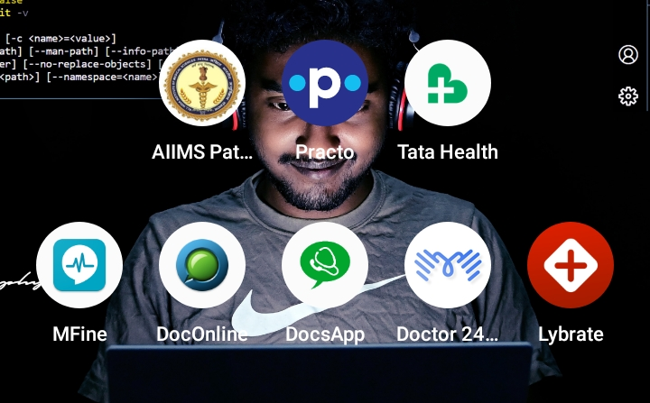

 
# UI - UX analysis of different medicare apps

 

## Introduction
   

Apps analyzed ---->

   

| Name       | Downloads  |
| ------------- |:-------------:| 
|  AIIMS PATNA      | 100 K |
|  PRACTO      | 5 M |
|  TATA HEALTH      | 1 M |
|  M FINE      | 5 M |
|  DOC ONLINE      | 100 K |
|  DOCS APP      | 5 M |
|  DOCTOR 24 X 7       | 100 K |
|  LYBRATE      | 5 M |

   

# AIMMS PATNA
## UI UX AFTER LAUNCH !
-  CHECK THE FOLDER

## FEATURES
 -   It allows new users to view department-wise consultant schedule and tariffs of OPD and IPD. 

 - It also allows for provisional registration of new patients using form-based or Aadhaar QR code scanning for collection of basic demographic details. 

 - Registered patients can also view reports of laboratory investigations, in addition to roster enquiry and tariffs view

   

# PRACTO
## UI UX AFTER LAUNCH !
-  CHECK THE FOLDER

## FEATURES
- Access video consultations with doctors
- Find & book appointments with a doctor near you
- Order medicines online
- Book diagnostic tests and full body checkups
- Buy affordable family health plans
- Read healthcare articles and tips

   

# TATA HEALTH
## UI UX AFTER LAUNCH !
-  CHECK THE FOLDER

## FEATURES
- Consult top doctors at your own convenience via video calls or chat. 
- Avail 24x7 Unlimited Consultations with General Medicine Doctors 
- Our doctors listen to you patiently and only prescribe what's necessary
- Nothing is hidden. Access your medical records in your Health Locker, 24x7
- Get solutions for any health issue anytime, anywhere through InstaDoc. Get instant access to doctors online 24/7 and personalized answers for the following health issues:
- Cough and cold
- Headache
- Stomach pain
- Nausea
- Indigestion
- Minor Injuries
 
Gynecologist
Consult the most trusted Gynecologists online within seconds. Get answers to your pre or post-pregnancy concerns and female reproductive health. Talk to a doctor regarding the following issues:
- PCOS
- Missed Periods
- Pregnancy issues
- UTI
- Infertility Problems

Consultant Physician
Get an instant diagnosis of any acute and chronic illness on the app. Get one-on-one online doctor consultation for:
- Diabetes Management
- Thyroid Problem
- Viral fever
- Respiratory problem
- Cholesterol Issue

Paediatrician
Diagnose, prevent, and treat any health issues affecting your child. Consult the best paediatricians online and get instant solutions at your fingertips. Talk to a doctor for the following issues:
- Child fever
- Ear Pain
- Vomiting
- Child Vaccinations
- Nutrition

Holistic Healthcare for you and your family!

- Instant consultation at your fingertips
-Health Subscription Packages
- Safe and secure chats
- 24/7 Online Doctor Consultation
- Video Consultation Facility
- Experienced Doctors
- Personalized care
- Access to doctors for any health concerns
- In-built footsteps tracker
- Integrated Lab and Medicine
- Medicine reminders
- NABL Certified Labs

   

# M FINE
## UI UX AFTER LAUNCH !
-  CHECK THE FOLDER

## FEATURES
- Consult Doctors Online Instantly
- Zero registration fees
- 5 days FREE follow-up
- HINDI, TELUGU & ENGLISH speaking doctors
- Video consult, call or online chat with doctor
- Instant, safe and secure
- Choose from Online Doctors across 30+ specialities

Health Assessment
- 20+ lifestyle & condition-based health check packages
- 1000+ tests including D-Dimer, Diabetes, HbA1c, infection tests
- Get Online reports within 24-48 hours
- Highest safety standards
- Includes Online Consultation with Doctor

Diagnostics at Center
- Convenient booking from top centers in the city
- . Book X-Ray, Ultrasound, MRI Scan, HRCT and more
- FREE Doctor Consultation on reports

Online Consultation- Call or Chat with a Doctor
- Choose your symptoms (like acne, fever, cough, cold, pcod, high bp, high blood sugar etc.)
- Select an online doctor of your choice (like gynaecologist, dermatologist, cardiologist etc.)
- Start your doctor consultation securely via chat, audio or video call
- Free Follow-up with the doctor for 5 days

At-Home Health Checks-Ensuring best hygiene and safety standards
- Select a health check
- Choose your preferred NABL-accredited lab
- Sample collected at preferred date, time and address
- Reports uploaded on the app
- Get personalized doctor consultation

Exclusive Features Only on MFine
- FREE self-assessment tools
- Free period tracker
- Medicine reminders
- Mental health counseling
- Digital health records
- Home care programs for Diabetes, Thyroid, Weight Management
- MFine Pulse- - SpO2 Tracker
-Disclaimer: Not intended for medical usage.
Available in select phones - View Device List

Get Primary Care from Physicians, Pediatricians, Gynecologists, Dermatologists, Dietitians via Online Consultation
- Common cold, fever, headache, vomiting, infections
- Child nutrition, growth & development, autism
- Irregular periods, PCOS, thyroid
- Acne, hair loss, eczema, hives
- Weight loss, weight gain, diabetes diet

Get Continuous & Chronic Care from Diabetologists, Cardiologists, Neurologists, Pulmonologists, Orthopedicians, Oncologists
- Diabetes, high blood pressure, arthritis
- Heart problems, breathing issues
- Neurological disorders, cancer

   

# DOC ONLINE
## UI UX AFTER LAUNCH !
-  CHECK THE FOLDER

## FEATURES
- Get online prescriptions and medicines home-delivered
- BMI CALCULATOR

   

# DOC APPS
## UI UX AFTER LAUNCH !
-  CHECK THE FOLDER

## FEATURES
- With DocsApp you can ask your Health or Medical questions to specialist doctors for diagnosis and medical advice.
- A specialist Doctor will be appointed to you instantly after a one-time consultation fee.
- Once a doctor is assigned, you can start a chat or video/audio call privately with the doctor.
- You can even upload health reports and photos for the Doctor to understand the issue better.
- After your consultation you can order medicines or book a lab test online through DocsApp
- Medicines will be delivered to your doorstep.
- Test samples will be picked up from the comfort of your home.
- A Specialist Doctor will help you understand your free online test report at no extra cost.
- DocsApp is also your online Medical record.Access video consultations with doctors
- You consultations are secure & private
- Get a second opinion on critical health concerns from doctors practicing in top cities in India

   

# DOCTOR 24 X 7
## UI UX AFTER LAUNCH !
-  CHECK THE FOLDER

## FEATURES
- Access video consultations with doctors

   

# LYBRATE
## UI UX AFTER LAUNCH !
-  CHECK THE FOLDER

## FEATURES
- Consult a Doctor Online in India - Anytime, Anywhere
- Access Video Consultations with Doctors
- Read Healthcare Articles and Learn Health tips
- Ask FREE Health Related Questions
- Order Health Care Products Online at GoodKart
- Find & book appointments with a doctor near you

 